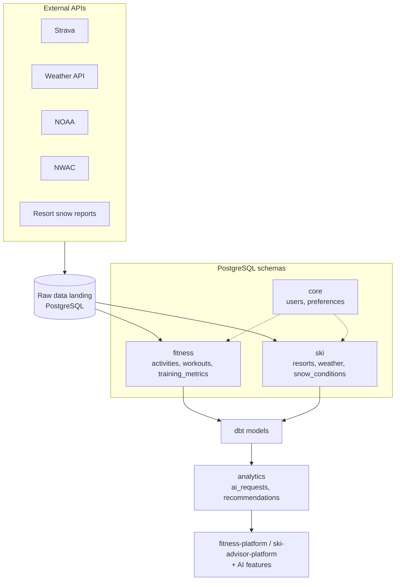

# Data Platform Architecture

> Status: planned/target architecture. See [`database.md`](../database.md).

```mermaid
flowchart TD
    subgraph Sources["External APIs"]
        Strava["Strava"]
        Weather["Weather API"]
        NOAA["NOAA"]
        NWAC["NWAC"]
        Resorts["Resort snow reports"]
    end

    Sources --> Raw[("Raw data landing<br/>PostgreSQL")]

    subgraph Schemas["PostgreSQL schemas"]
        Core["core<br/>users, preferences"]
        FitnessSchema["fitness<br/>activities, workouts, training_metrics"]
        SkiSchema["ski<br/>resorts, weather, snow_conditions"]
    end

    Raw --> FitnessSchema
    Raw --> SkiSchema
    Core -.-> FitnessSchema
    Core -.-> SkiSchema

    FitnessSchema --> Dbt["dbt models"]
    SkiSchema --> Dbt

    Dbt --> Analytics["analytics<br/>ai_requests, recommendations"]

    Analytics --> Apps["fitness-platform / ski-advisor-platform<br/>+ AI features"]
```
