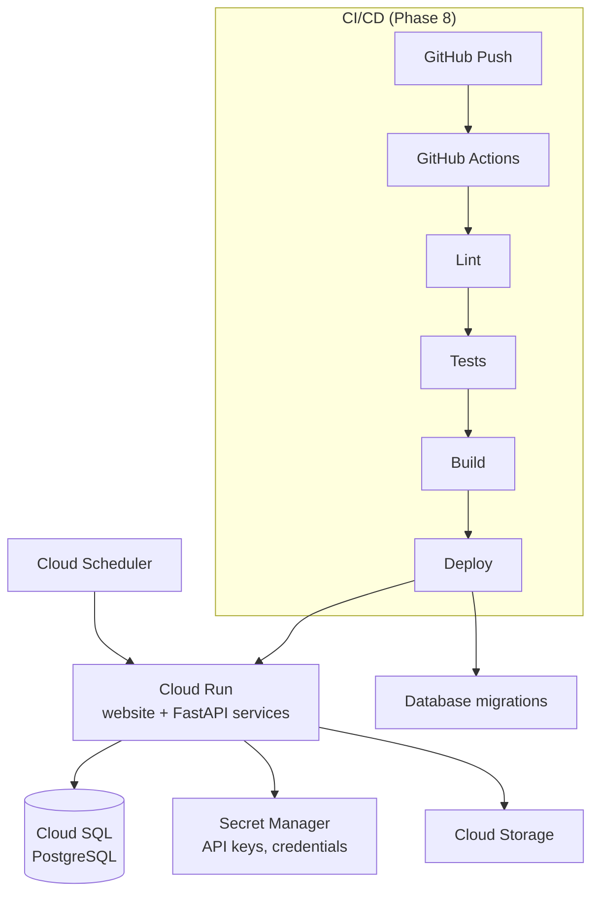

# Cloud Deployment Architecture

> Status: planned/target architecture. See [`deployment.md`](../deployment.md).

```mermaid
flowchart TD
    subgraph CICD["CI/CD (Phase 8)"]
        Push["GitHub Push"] --> Actions["GitHub Actions"]
        Actions --> Lint["Lint"] --> Tests["Tests"] --> Build["Build"] --> Deploy["Deploy"]
    end

    Deploy --> CloudRun["Cloud Run<br/>website + FastAPI services"]
    Deploy --> Migrations["Database migrations"]

    CloudRun --> CloudSQL[("Cloud SQL<br/>PostgreSQL")]
    CloudRun --> SecretManager["Secret Manager<br/>API keys, credentials"]
    CloudRun --> CloudStorage["Cloud Storage"]

    Scheduler["Cloud Scheduler"] --> CloudRun
```
