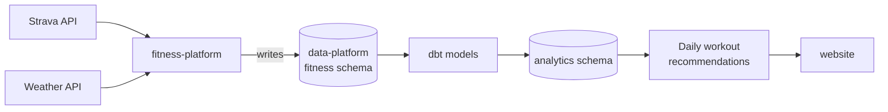

# Fitness Data Flow

> Status: planned/target architecture. See [`roadmap.md`](../roadmap.md#phase-4--fitness-platform-mvp).

```mermaid
flowchart LR
    Strava["Strava API"] --> Fitness["fitness-platform"]
    WeatherAPI["Weather API"] --> Fitness

    Fitness -- writes --> FitnessSchema[("data-platform<br/>fitness schema")]
    FitnessSchema --> Dbt["dbt models"]
    Dbt --> Analytics[("analytics schema")]

    Analytics --> Recs["Daily workout<br/>recommendations"]
    Recs --> Website["website"]
```
