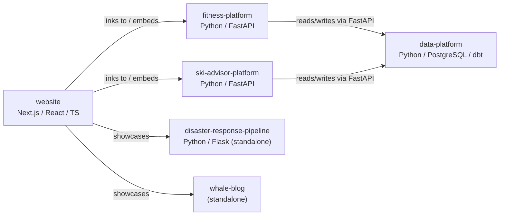

# Repository Relationships

> Status: planned/target architecture. See [`architecture.md`](../architecture.md#repository-structure).

```mermaid
flowchart LR
    Website["website<br/>Next.js / React / TS"]
    DataPlatform["data-platform<br/>Python / PostgreSQL / dbt"]
    Fitness["fitness-platform<br/>Python / FastAPI"]
    Ski["ski-advisor-platform<br/>Python / FastAPI"]
    Disaster["disaster-response-pipeline<br/>Python / Flask (standalone)"]
    Whale["whale-blog<br/>(standalone)"]

    Website -- links to / embeds --> Fitness
    Website -- links to / embeds --> Ski
    Website -- showcases --> Disaster
    Website -- showcases --> Whale

    Fitness -- reads/writes via FastAPI --> DataPlatform
    Ski -- reads/writes via FastAPI --> DataPlatform
```
