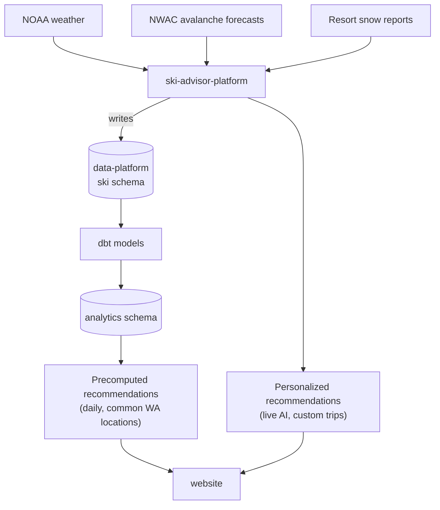

# Ski Advisor Data Flow

> Status: planned/target architecture. See [`roadmap.md`](../roadmap.md#phase-5--ski-advisor-platform-mvp).

```mermaid
flowchart TD
    NOAA["NOAA weather"] --> Ski["ski-advisor-platform"]
    NWAC["NWAC avalanche forecasts"] --> Ski
    Resorts["Resort snow reports"] --> Ski

    Ski -- writes --> SkiSchema[("data-platform<br/>ski schema")]
    SkiSchema --> Dbt["dbt models"]
    Dbt --> Analytics[("analytics schema")]

    Analytics --> Precomputed["Precomputed recommendations<br/>(daily, common WA locations)"]
    Ski --> Personalized["Personalized recommendations<br/>(live AI, custom trips)"]

    Precomputed --> Website["website"]
    Personalized --> Website
```
