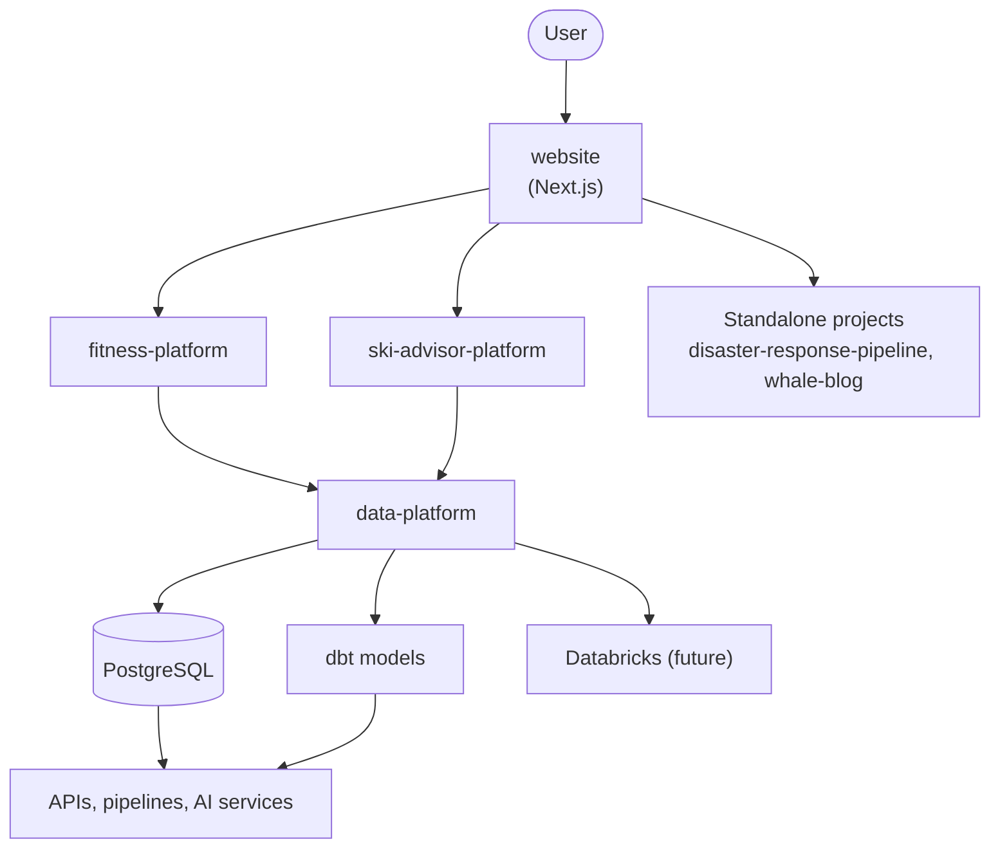

# System Architecture

> Status: planned/target architecture. See [`architecture.md`](../architecture.md).

```mermaid
flowchart TD
    User(["User"])
    User --> Website["website<br/>(Next.js)"]

    Website --> Fitness["fitness-platform"]
    Website --> Ski["ski-advisor-platform"]
    Website --> Projects["Standalone projects<br/>disaster-response-pipeline, whale-blog"]

    Fitness --> DataPlatform["data-platform"]
    Ski --> DataPlatform

    DataPlatform --> Postgres[("PostgreSQL")]
    DataPlatform --> Dbt["dbt models"]
    DataPlatform --> Databricks["Databricks (future)"]

    Postgres --> Services["APIs, pipelines, AI services"]
    Dbt --> Services
```
